# Neon Database Reference & Cheatsheet

This document serves as the comprehensive reference and cheatsheet for all tables created and actively used on the Neon PostgreSQL database by the PgStudio (NexQL) backend.

The database is divided into two primary schemas:
1. **`pgstudio_license`**: Manages user licenses, device bindings, transaction events, and Razorpay webhook idempotency.
2. **`pgstudio_sync`**: Powers the NexQL Cloud Sync v2 service using an optimized, git-like, end-to-end encrypted delta synchronization mechanism.

---

## 📊 Database Relationships & Entity Diagram

The following Mermaid diagram outlines the entity-relationship model and schema separation within the Neon database:

```mermaid
erDiagram
    %% Schema: pgstudio_license
    subgraph pgstudio_license ["Schema: pgstudio_license (Licensing)"]
        licenses {
            text license_key PK
            text tier "sponsor | singularity"
            text period "monthly | yearly"
            text currency
            text status "active | cancelled | halted | paused | expired | revoked"
            text subscription_id UK
            text email
            timestamptz expires_at
            timestamptz created_at
            timestamptz updated_at
        }
        devices {
            text license_key PK, FK
            text instance_id PK
            text device_name
            timestamptz first_seen
            timestamptz last_seen
            timestamptz revoked_at
        }
        license_events {
            bigint id PK "identity"
            text license_key FK
            text event_type "issued | tier_changed | status_changed | validated_ok | ..."
            jsonb detail
            text source "store | validate | devices_api | cron | ..."
            timestamptz created_at
        }
        webhook_events {
            text razorpay_event_id PK
            timestamptz received_at
        }
    end

    %% Schema: pgstudio_sync
    subgraph pgstudio_sync ["Schema: pgstudio_sync (NexQL Cloud Sync)"]
        sync_accounts {
            text account_id PK "maps to license_key or github_id"
            text tier "sponsor | singularity"
            bigint bytes_used
            integer item_count
            timestamptz inactive_since
            timestamptz updated_at
        }
        sync_devices {
            text account_id PK, FK
            text device_id PK
            text device_name
            timestamptz last_seen
        }
        spaces {
            text space_id PK "personal (account_id) or shared workspace"
            text name
            text owner_email
            timestamptz created_at
        }
        space_members {
            text space_id PK, FK
            text email PK
            text role "owner | editor | viewer"
            timestamptz added_at
        }
        items_v2 {
            text space_id PK, FK
            text item_id PK
            text kind "connection | query | notebook"
            bytea blob "encrypted payload"
            text content_hash
            bigint version "monotonic seq"
            text device_id
            timestamptz updated_at
        }
        deletes_v2 {
            text space_id PK, FK
            text item_id PK
            bigint version "monotonic seq"
            text deleted_by
            timestamptz deleted_at
        }
    end

    %% Foreign Key Relationships
    licenses ||--o{ devices : "has bound"
    licenses ||--o{ license_events : "generates"
    
    sync_accounts ||--o{ sync_devices : "registers"
    spaces ||--o{ space_members : "has members"
    spaces ||--o{ items_v2 : "contains"
    spaces ||--o{ deletes_v2 : "tombstones"
```



---

## 🗂️ Active Usage Matrix

| Schema / Table | Status | Read / Write Intensity | Primary Purpose | Why it is Used & What relies on it |
| :--- | :--- | :--- | :--- | :--- |
| **`pgstudio_license.licenses`** | **Active** | High / Medium | Entitlement State | Tracks subscription tiers, expiration dates, and validation status. Relied upon by client licensing API requests. |
| **`pgstudio_license.devices`** | **Active** | High / High | Device Validation | Prevents users from exceeding activation limits (4 devices per tier). Excess devices pruned on validate. |
| **`pgstudio_license.license_events`** | **Active** | Low / Medium | Audit Trail | Log of license changes (issuance, device bindings, subscription status modifications). |
| **`pgstudio_license.webhook_events`** | **Active** | Medium / Low | Idempotency | Ensures Razorpay webhooks are processed exactly once. |
| **`pgstudio_sync.sync_accounts`** | **Active** | High / Medium | Quota & Storage Tracking | Stores tenant usage limits (bytes used, item count, tier) and triggers cloud pruning if inactive. |
| **`pgstudio_sync.sync_devices`** | **Active** | Medium / Medium | Sync Device Registry | Tracks active sync client devices for each user account. |
| **`pgstudio_sync.spaces`** | **Active** | Medium / Low | Shared Workspace Registry | Models collaboration units (e.g. shared folders/teams). Personal folders are implicit. |
| **`pgstudio_sync.space_members`** | **Active** | High / Low | ACL / Role Mapping | Authorizes pull/push actions for workspaces using Roles (`owner`, `editor`, `viewer`). |
| **`pgstudio_sync.items_v2`** | **Active** | High / High | Encrypted Sync Storage | Holds AES-256-GCM encrypted client configurations, queries, and notebook blobs. |
| **`pgstudio_sync.deletes_v2`** | **Active** | High / Medium | Delete Logs (Tombstones) | Git-like tombstones to prevent deleted items from resurrecting on client pulls. |

---

## 🔧 Schema `pgstudio_license` (Detailed Definition)

This schema controls user licenses and limits device activations.

### 1. `licenses`
Stores valid license keys, emails, tiers, subscription periods, status, and expiry details.

* **DDL Definition**:
  ```sql
  CREATE TABLE IF NOT EXISTS pgstudio_license.licenses (
    license_key      TEXT PRIMARY KEY,
    tier             TEXT NOT NULL CHECK (tier IN ('sponsor','singularity')),
    period           TEXT NOT NULL DEFAULT 'monthly',
    currency         TEXT,
    status           TEXT NOT NULL DEFAULT 'active'
      CHECK (status IN ('active','cancelled','halted','paused','expired','revoked')),
    subscription_id  TEXT UNIQUE,
    email            TEXT,
    expires_at       TIMESTAMPTZ,
    created_at       TIMESTAMPTZ NOT NULL DEFAULT now(),
    updated_at       TIMESTAMPTZ NOT NULL DEFAULT now()
  );
  ```
* **Indexes**:
  * `licenses_email_idx` ON `lower(email)` for fast case-insensitive email matches.
* **Why & What**: 
  * Checks status during extension startup and device activation.
  * Links Razorpay subscriptions back to the license instance.

### 2. `devices`
Tracks active client machines bound to each license key.

* **DDL Definition**:
  ```sql
  CREATE TABLE IF NOT EXISTS pgstudio_license.devices (
    license_key  TEXT NOT NULL REFERENCES pgstudio_license.licenses(license_key),
    instance_id  TEXT NOT NULL,
    device_name  TEXT,
    first_seen   TIMESTAMPTZ NOT NULL DEFAULT now(),
    last_seen    TIMESTAMPTZ NOT NULL DEFAULT now(),
    revoked_at   TIMESTAMPTZ,
    PRIMARY KEY (license_key, instance_id)
  );
  ```
* **Why & What**:
  * Enforces maximum active devices (`4` for both `sponsor` and `singularity`). Excess devices are pruned on validate (oldest `last_seen` first).
  * If a user requests a bind that exceeds their tier's threshold, the backend blocks it or prompts a revocation.
  * `revoked_at` is updated to audit historical bindings rather than physically deleting rows.

### 3. `license_events`
Stores an append-only JSON audit log of operations associated with a license.

* **DDL Definition**:
  ```sql
  CREATE TABLE IF NOT EXISTS pgstudio_license.license_events (
    id           BIGINT GENERATED ALWAYS AS IDENTITY PRIMARY KEY,
    license_key  TEXT NOT NULL,
    event_type   TEXT NOT NULL,
    detail       JSONB NOT NULL DEFAULT '{}'::jsonb,
    source       TEXT NOT NULL,
    created_at   TIMESTAMPTZ NOT NULL DEFAULT now()
  );
  ```
* **Indexes**:
  * `license_events_key_created_idx` ON `(license_key, created_at DESC)`
* **Why & What**:
  * Logs actions like `issued`, `tier_changed`, `status_changed`, `device_bound`, `device_removed`, and `validated_ok` for developer debugging.

### 4. `webhook_events`
Protects subscription webhook handlers against network retransmissions and double-processing.

* **DDL Definition**:
  ```sql
  CREATE TABLE IF NOT EXISTS pgstudio_license.webhook_events (
    razorpay_event_id TEXT PRIMARY KEY,
    received_at       TIMESTAMPTZ NOT NULL DEFAULT now()
  );
  ```
* **Why & What**:
  * The Razorpay webhook handler checks this table before updating `licenses` to avoid repeating operations (e.g. extending expiry multiple times).

---

## 📡 Schema `pgstudio_sync` (Detailed Definition)

Powers the git-like, multi-device cloud synchronization feature.

### 1. `items_v2`
Stores the active state of sync items (connections, queries, and SQL notebooks).

* **DDL Definition**:
  ```sql
  CREATE TABLE IF NOT EXISTS pgstudio_sync.items_v2 (
    space_id     TEXT        NOT NULL,
    item_id      TEXT        NOT NULL,
    kind         TEXT        NOT NULL CHECK (kind IN ('connection','query','notebook')),
    blob         BYTEA       NOT NULL,
    content_hash TEXT        NOT NULL,
    version      BIGINT      NOT NULL,
    device_id    TEXT        NOT NULL,
    updated_at   TIMESTAMPTZ NOT NULL DEFAULT now(),
    PRIMARY KEY (space_id, item_id)
  );
  ```
* **Indexes & Sequences**:
  * Sequence: `pgstudio_sync.cursor_seq` used to supply monotonic version sequences.
  * Index: `items_v2_cursor_idx` ON `(space_id, version)` used to accelerate delta pulls.
* **Why & What**:
  * Contains the encrypted sync payloads (encrypted client-side using AES-256-GCM).
  * Optimistic concurrency uses `version` to guarantee a compare-and-swap update model during push batches.

### 2. `deletes_v2`
Tombstone ledger tracking deleted items in a space.

* **DDL Definition**:
  ```sql
  CREATE TABLE IF NOT EXISTS pgstudio_sync.deletes_v2 (
    space_id   TEXT        NOT NULL,
    item_id    TEXT        NOT NULL,
    version    BIGINT      NOT NULL,
    deleted_by TEXT        NOT NULL,
    deleted_at TIMESTAMPTZ NOT NULL DEFAULT now(),
    PRIMARY KEY (space_id, item_id)
  );
  ```
* **Indexes**:
  * `deletes_v2_cursor_idx` ON `(space_id, version)`
* **Why & What**:
  * Because items are completely deleted from `items_v2` to save space, the tombstone log keeps track of deletion version numbers so other clients pull information about deleted items.

### 3. `spaces` & `space_members`
Models shared team spaces and role permissions. Personal spaces are represented implicitly (where `space_id` matches the user's `account_id`).

* **DDL Definitions**:
  ```sql
  CREATE TABLE IF NOT EXISTS pgstudio_sync.spaces (
    space_id    TEXT        PRIMARY KEY,
    name        TEXT        NOT NULL,
    owner_email TEXT        NOT NULL,
    created_at  TIMESTAMPTZ NOT NULL DEFAULT now()
  );

  CREATE TABLE IF NOT EXISTS pgstudio_sync.space_members (
    space_id TEXT        NOT NULL REFERENCES pgstudio_sync.spaces(space_id) ON DELETE CASCADE,
    email    TEXT        NOT NULL,
    role     TEXT        NOT NULL CHECK (role IN ('owner','editor','viewer')),
    added_at TIMESTAMPTZ NOT NULL DEFAULT now(),
    PRIMARY KEY (space_id, email)
  );
  ```
* **Why & What**:
  * Restricts access to team shared workspaces (e.g. read access for `viewers`, write access for `editors` and `owners`).

### 4. `sync_accounts` & `sync_devices`
Tracks quota limits, active sync client configurations, and handles retention parameters.

* **DDL Definitions**:
  ```sql
  CREATE TABLE IF NOT EXISTS pgstudio_sync.sync_accounts (
    account_id     TEXT        PRIMARY KEY,
    tier           TEXT        NOT NULL DEFAULT 'sponsor',
    bytes_used     BIGINT      NOT NULL DEFAULT 0,
    item_count     INT         NOT NULL DEFAULT 0,
    inactive_since TIMESTAMPTZ,
    updated_at     TIMESTAMPTZ NOT NULL DEFAULT now()
  );

  CREATE TABLE IF NOT EXISTS pgstudio_sync.sync_devices (
    account_id   TEXT        NOT NULL,
    device_id    TEXT        NOT NULL,
    device_name  TEXT,
    last_seen    TIMESTAMPTZ NOT NULL DEFAULT now(),
    PRIMARY KEY (account_id, device_id)
  );
  ```
* **Indexes**:
  * `sync_devices_account_idx` ON `(account_id, last_seen DESC)`
* **Why & What**:
  * Monitors user accounts for inactivity.
  * Quota checks calculate `SUM(octet_length(blob))` on pushes to enforce strict payload sizing and storage boundaries.

---

## 🔄 Maintenance & Automated Routines

### 1. Subscription Expiration Cron
Runs periodically (via `expirePastDueLicenses()`) to flag licenses whose expiration timestamp has passed as `'expired'`.
```sql
UPDATE pgstudio_license.licenses
SET status = 'expired', updated_at = now()
WHERE status = 'active'
  AND expires_at IS NOT NULL
  AND expires_at < now()
RETURNING license_key, expires_at;
```
For each expired license, a `'status_changed'` audit event is logged in `license_events`.

### 2. Inactive Cloud Data Pruning Cron
To optimize Neon DB storage usage, a routine runs (`purgeInactiveCloudData()`) to purge sync payloads for accounts that have been inactive longer than `CLOUD_INACTIVE_RETENTION_DAYS` (defaults to 30 days).
1. Looks up sync accounts flagged with `inactive_since` older than 30 days.
2. Permanently deletes blobs and account entries from `items_v2`, `deletes_v2`, `sync_devices`, `spaces`, and `sync_accounts`.

### 3. Backfill One-Off Script
A CLI script `scripts/backfill-license-kv-to-neon.js` allows migrating license entitlements from legacy KV databases (or local dev files) into `pgstudio_license.licenses` inside the Neon DB.

---

## 🔍 Administration & Diagnostics SQL Queries

The following queries help query and audit users, their license details, storage space usage, and active devices.

### 1. Retrieve Unique Users, Licensing Details, and Storage Footprints
This query compiles a complete profile of each unique user, joining their licensing data with their sync cloud storage quotas and active status.

```sql
SELECT 
    l.email AS user_email,
    l.license_key,
    l.tier AS license_tier,
    l.status AS license_status,
    l.expires_at AS license_expiry,
    COALESCE(sa.bytes_used, 0) AS sync_bytes_used,
    COALESCE(sa.item_count, 0) AS sync_item_count,
    sa.inactive_since AS sync_inactive_since,
    l.created_at AS user_created_at
FROM pgstudio_license.licenses l
LEFT JOIN pgstudio_sync.sync_accounts sa 
    ON l.license_key = sa.account_id OR lower(l.email) = lower(sa.account_id)
ORDER BY l.created_at DESC;
```

### 2. Retrieve All Active Licensing Devices per User
This query filters out revoked bindings to list active instances validated under each user's license tier.

```sql
SELECT 
    l.email AS user_email,
    l.tier AS license_tier,
    d.instance_id AS device_instance_id,
    COALESCE(d.device_name, 'Unnamed Device') AS device_name,
    d.first_seen,
    d.last_seen
FROM pgstudio_license.licenses l
JOIN pgstudio_license.devices d ON l.license_key = d.license_key
WHERE d.revoked_at IS NULL
ORDER BY l.email, d.last_seen DESC;
```

### 3. Retrieve All Active Sync Client Devices per User
This query audits sync devices that have recently executed synchronization processes under the account sync credentials.

```sql
SELECT 
    l.email AS user_email,
    sd.device_id AS sync_device_id,
    COALESCE(sd.device_name, 'Unnamed Device') AS sync_device_name,
    sd.last_seen AS sync_device_last_seen
FROM pgstudio_license.licenses l
JOIN pgstudio_sync.sync_devices sd ON l.license_key = sd.account_id
ORDER BY l.email, sd.last_seen DESC;
```

### 4. Consolidated Active Devices (Licensed & Sync Combined)
This query unions license validation devices and sync client instances, giving you a full mapping of active nodes for every unique user/email.

```sql
WITH combined_devices AS (
    -- Licensed Devices (Non-Revoked)
    SELECT 
        l.email AS user_email,
        l.license_key,
        'license_activation' AS device_source,
        d.instance_id AS device_id,
        d.device_name,
        d.last_seen
    FROM pgstudio_license.licenses l
    JOIN pgstudio_license.devices d ON l.license_key = d.license_key
    WHERE d.revoked_at IS NULL
    
    UNION ALL
    
    -- Sync Devices
    SELECT 
        l.email AS user_email,
        l.license_key,
        'sync_connection' AS device_source,
        sd.device_id AS device_id,
        sd.device_name,
        sd.last_seen
    FROM pgstudio_license.licenses l
    JOIN pgstudio_sync.sync_devices sd ON l.license_key = sd.account_id
)
SELECT 
    user_email,
    license_key,
    device_source,
    device_id,
    COALESCE(device_name, 'Unnamed Device') AS device_name,
    last_seen
FROM combined_devices
ORDER BY user_email, last_seen DESC;
```

### 5. Audit Shared Collaboration Workspaces (Spaces) & Roster Roles
Lists all team workspaces, showing owner details, shared member emails, and their ACL permission roles.

```sql
SELECT 
    s.space_id,
    s.name AS workspace_name,
    s.owner_email,
    sm.email AS member_email,
    sm.role AS member_role,
    sm.added_at
FROM pgstudio_sync.spaces s
JOIN pgstudio_sync.space_members sm ON s.space_id = sm.space_id
ORDER BY s.owner_email, s.name, sm.role DESC;
```

