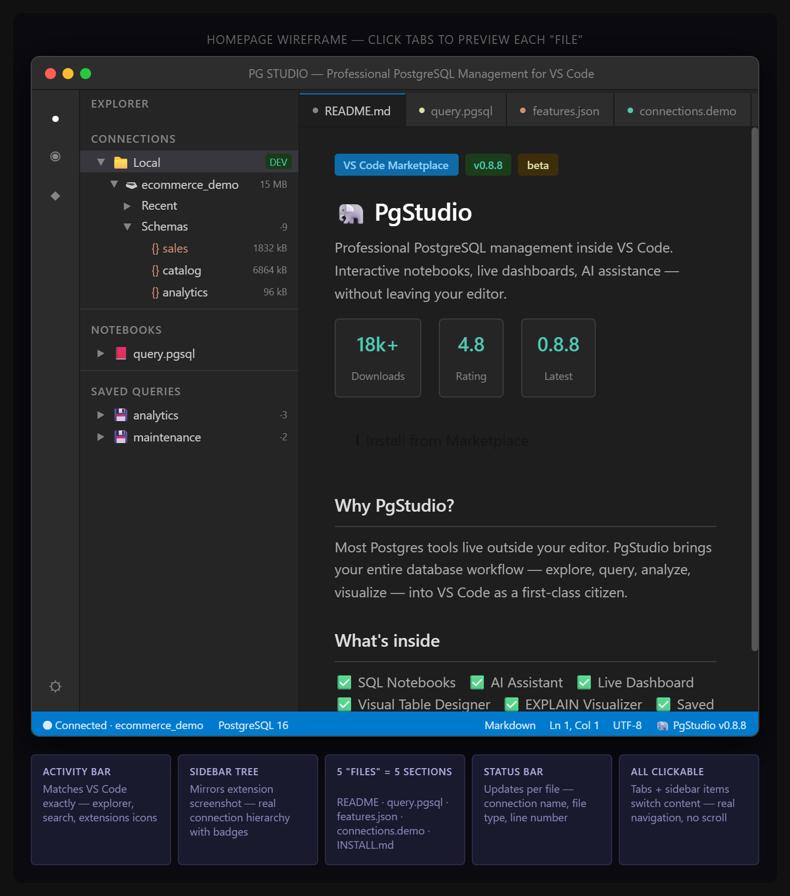

This is a genuinely exciting brief. Let me think through a distinctive concept before diving into implementation.

## The Concept: "The Living IDE"

The homepage *is* a VS Code instance. Visitors land inside a functional-feeling editor environment — sidebar, tabs, status bar, everything — but the "files" they open are the marketing content. The experience teaches what PgStudio feels like by making the website itself feel like PgStudio.

Here's the full implementation plan:

---

## Design Direction

**Aesthetic**: VS Code dark theme fidelity meets editorial storytelling. The chrome looks exactly like VS Code (activity bar, sidebar, editor tabs, status bar, minimap). But the content inside the "files" is beautifully typeset marketing copy, live demos, and animated diagrams — not actual code files. The contrast between the sterile IDE shell and rich visual content inside it creates a memorable tension.

**The "Files" as Navigation**:
- `README.md` → Hero / What is PgStudio (rendered markdown styling)
- `connections.demo` → Interactive connection form demo
- `features.json` → Feature grid shown as a "JSON explorer"
- `query.pgsql` → Live animated SQL notebook demo
- `INSTALL.md` → Quick start / CTA

**What makes it unforgettable**: The status bar at the bottom shows real-feeling data (fake "Connected to ecommerce_demo · 15 MB", fake row counts), the sidebar tree mirrors the screenshot from the extension, and hovering tree items shows tooltips. The entire page feels like a preview/demo of the tool itself.

---

## Implementation Architecture

### File Structure
```
index.html          ← Single file, self-contained
styles.css          ← (or inline in <style>)
script.js           ← (or inline in <script>)
```

Or a single `index.html` with everything inline for simplicity.

---

### Layout Structure

```
┌─────────────────────────────────────────────────────────────┐
│  Traffic lights  ●●●  PG STUDIO  [title bar]                │
├────┬────────────┬────────────────────────────┬──────────────┤
│    │  EXPLORER  │  [tabs: README.md ×  ...]  │  OUTLINE     │
│ 🐘 ├────────────┤                             │              │
│    │  CONNECTIONS│ ┌─────────────────────┐   │  > Hero      │
│ 🔍 │  ▼ Local   │ │                     │   │  > Features  │
│    │   ▼ test_db│ │  File Content Area  │   │  > Install   │
│ ⚙️  │    > Recent│ │  (marketing copy)   │   │              │
│    │    ▼ sales  │ │                     │   │              │
│    │      tables │ └─────────────────────┘   │              │
├────┴────────────┴────────────────────────────┴──────────────┤
│  ⬤ Connected · ecommerce_demo  Ln 1  UTF-8  PostgreSQL 16   │
└─────────────────────────────────────────────────────────────┘
```

---

### Key Implementation Details

#### 1. The Chrome (VS Code Shell)

```html
<div class="vscode-shell">
  <div class="title-bar">…</div>
  <div class="workbench">
    <div class="activity-bar">…</div>
    <div class="sidebar">…</div>
    <div class="editor-area">
      <div class="tab-bar">…</div>
      <div class="editor-content">…</div>
    </div>
    <div class="minimap">…</div>  <!-- optional -->
  </div>
  <div class="status-bar">…</div>
</div>
```

All colors use the exact VS Code dark theme CSS tokens:
```css
--vsc-bg: #1e1e1e;
--vsc-sidebar: #252526;
--vsc-activitybar: #333333;
--vsc-tab-active: #1e1e1e;
--vsc-tab-inactive: #2d2d2d;
--vsc-statusbar: #007acc;
--vsc-accent: #0e7490;
--vsc-text: #cccccc;
--vsc-text-muted: #858585;
--vsc-highlight: #264f78;
--vsc-border: #3c3c3c;
```

#### 2. The Sidebar Tree

Mirrors the exact tree from the screenshot — same icons, same indentation, same badge counts. Clicking a schema/table highlights it and optionally opens a "file" tab.

```html
<div class="tree-item" data-opens="connections.demo">
  <span class="codicon">⚙</span>
  <span class="label">Local</span>
  <span class="badge">DEV</span>
</div>
```

Tree items that are clickable have hover states and trigger tab switches.

#### 3. File Tabs & Routing

Pure JS tab switcher — clicking a tab or tree item swaps the content panel with a crossfade:

```js
const files = {
  'README.md':         renderReadme,
  'connections.demo':  renderConnectionsDemo,
  'features.json':     renderFeaturesJson,
  'query.pgsql':       renderQueryDemo,
  'INSTALL.md':        renderInstall,
};
```

Each `render*` function returns an HTML string. The active file name shows in the status bar.

#### 4. `README.md` — The Hero File

Rendered as a beautiful "GitHub-style markdown preview" inside the editor. Has:
- Large elephant icon + PgStudio headline
- 3 animated stat badges (downloads, rating, version — fetch from marketplace API)
- Short tagline paragraph
- "Install" CTA button that glows

#### 5. `query.pgsql` — The Live Demo File

This is the showstopper. Looks exactly like a `.pgsql` notebook cell:

```
[CodeLens: ▶ Run  ✨ Ask AI  Explain  Optimize]

  SELECT
    date_trunc('day', created_at) AS day,
    COUNT(*) AS users,
    SUM(amount) AS revenue
  FROM orders
  WHERE created_at >= NOW() - INTERVAL '7 days'
  GROUP BY day ORDER BY day;

[Results table — animated typing-in effect]
[Chart tab showing bar chart]
```

The "Run" button triggers a fake execution animation: spinner → row count badge → table appears with staggered row fade-ins → then a chart fades in below.

#### 6. `features.json` — Features as JSON Explorer

The feature list rendered as a syntax-highlighted JSON tree. Each key is a feature name, values are descriptions. Hovering a key highlights it. This is quirky and memorable.

```json
{
  "sql_notebooks": {
    "description": "Interactive notebooks with AI assistance",
    "status": "✅ live",
    "since": "v0.6.0"
  },
  "visual_table_designer": { … },
  …
}
```

#### 7. `connections.demo` — Connection Form Preview

A read-only (but pixel-perfect) replica of the connection form panel, showing fields filled with demo data. A small "Connect" button animates the sidebar tree populating. Makes it tangible.

#### 8. `INSTALL.md` — CTA File

Clean markdown-style page with:
- Install steps (numbered, with icons)
- Code blocks with `code --install-extension ric-v.postgres-explorer`
- Big "Install from Marketplace" button
- Link to GitHub

#### 9. Status Bar

Always shows context-appropriate text based on active file:
- On `query.pgsql`: `⬤ Connected · ecommerce_demo  PostgreSQL 16  Ln 4, Col 12`
- On `README.md`: `🐘 PgStudio v0.8.8  UTF-8  Markdown`
- On `features.json`: `JSON  10 keys  UTF-8`

#### 10. Mobile Responsiveness

On mobile, the activity bar collapses, the sidebar becomes a bottom sheet or hamburger, and the editor fills the screen. The tab bar becomes a horizontal scroll strip.

---

### Animations & Polish

| Element | Animation |
|---|---|
| Page load | Status bar slides up, editor fades in, sidebar tree items stagger down |
| Tab switch | Content crossfades (150ms opacity) |
| Query "run" | Progress bar → table rows stagger in (20ms delay each) |
| Tree hover | Row highlight with `#2a2d2e` fill |
| SQL syntax | Static syntax highlighting (regex-based, no library needed) |
| Status bar text | Typewriter effect when file changes |
| Install button | Subtle pulse glow on `@keyframes` |

---

### Fonts

- **UI chrome**: `'Segoe UI'`, `-apple-system` — matches VS Code exactly
- **Code/SQL**: `'Cascadia Code'`, `'Fira Code'`, `monospace` — matches VS Code editor
- **Markdown headings in README.md file**: `'Georgia'` or a serif for contrast — makes the "rendered markdown" feel like GitHub's markdown preview, distinct from the chrome

---

### External Dependencies (zero mandatory, optional CDN)

- Chart.js (CDN) — for the fake query result chart in `query.pgsql`
- No frameworks needed — vanilla JS is perfect for this and keeps it fast

---

### Responsive Breakpoints

```css
/* Desktop: full IDE layout */
@media (min-width: 1024px) { /* 3-column: activity + sidebar + editor */ }

/* Tablet: hide sidebar by default, toggle button */
@media (max-width: 1023px) { /* sidebar hidden, show toggle */ }

/* Mobile: just the editor + bottom tab strip */
@media (max-width: 640px) { /* activity bar hidden, simplified */ }
```

---

### SEO & Meta

Since it's a real website, the `<head>` still needs:
```html
<title>PgStudio — PostgreSQL Management for VS Code</title>
<meta name="description" content="…">
<meta property="og:image" content="…screenshot…">
```

And the actual text content (headings, paragraphs) should be real DOM text, not just canvas/SVG — for crawlability. The VS Code "chrome" is decoration; the content inside is real HTML.

---

### What Sets This Apart

Most tool landing pages either show screenshots or fake demos. This one *is* the demo — the website and the product share the same visual language. A developer landing on this page will feel at home within 2 seconds because it's their daily environment. The subconscious message is: "this tool belongs in my editor."

The file-as-navigation metaphor also solves the problem of "website that teaches you about the product" — each file teaches a different thing, and you navigate it the same way you navigate code. That's memorable.

---

Want me to build this out as a full working `index.html`? I can implement the complete thing — VS Code chrome, all 5 "files", animated query demo with Chart.js, the real sidebar tree from your screenshot, and the status bar — as a single self-contained file ready to deploy to `pgstudio.astrx.dev`.


The wireframe is fully interactive — click any tab or sidebar item to preview each section. Here's what each piece represents for the final build:

**The 5 files as page sections:**
- `README.md` — hero / above-the-fold. Stats, tagline, install CTA. Renders like a GitHub markdown preview inside the editor.
- `query.pgsql` — the showstopper demo. An actual-looking notebook cell with syntax-highlighted SQL and a result table. In the final version, clicking Run triggers a fake execution animation.
- `features.json` — features as syntax-highlighted JSON. Quirky and memorable. Each key is hoverable.
- `connections.demo` — a replica of the connection form from the extension. Makes the product tangible before installing.
- `INSTALL.md` — clean install steps + big CTA button.

**Key decisions visible in the wireframe:**
- The status bar updates per file (notice the connection name and file type change)
- The sidebar tree mirrors your actual screenshot exactly — same schemas, same badge counts
- Tab colors match file types (yellow for `.pgsql`, orange for `.json`, blue for `.md`)
- The activity bar has the correct VS Code icon positions

Ready to build the full production `index.html` whenever you want — this wireframe validates the concept first.

